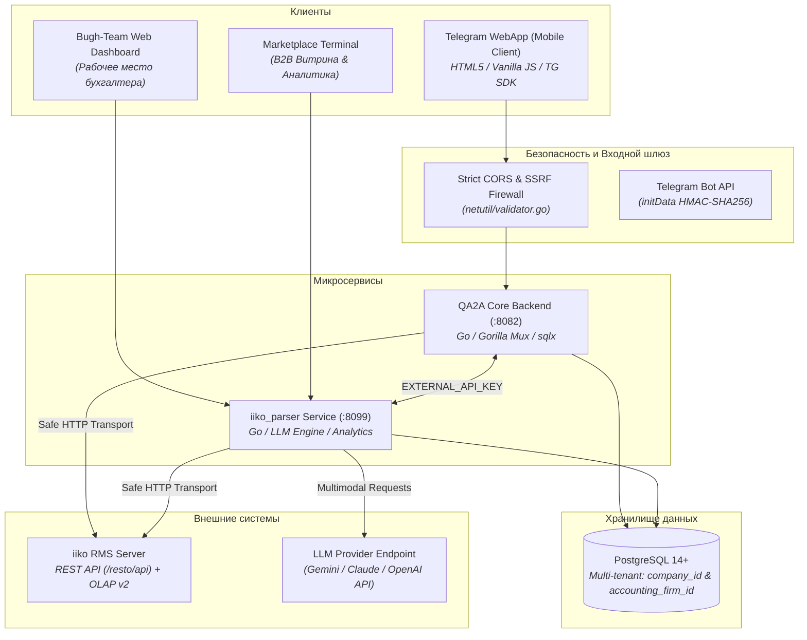

# 🚀 QA2A & iiko Parser — Enterprise HoReCa Automation Platform

[](https://golang.org/)
[](https://www.postgresql.org/)
[](https://core.telegram.org/bots/webapps)
[](https://iiko.ru/)
[]()

**QA2A** — модульная распределенная ERP-система складского учета, инвентаризации, бухгалтерского документооборота и B2B-закупок для предприятий общественного питания (рестораны, бары, кофейни, фабрики-кухни) с бесшовной двусторонней интеграцией с ресторанным учетным комплексом **iiko RMS**.

---

## 📑 Единый источник истины (Source of Truth Documentation)

Полная техническая документация Enterprise-уровня доступна в каталоге [`docs/`](./docs/):

| Раздел | Документ | Описание |
| :--- | :--- | :--- |
| **ЧАСТЬ 1** | [**01. Архитектура и Product Overview**](./docs/01-architecture-overview.md) | Описание продукта, решаемые боли HoReCa, общая схема взаимодействия компонентов (Mermaid), спецификация сервисов и ролевая модель (RBAC). |
| **ЧАСТЬ 2** | [**02. Карта кодовой базы и слои**](./docs/02-codebase-map.md) | Дерево папок обоих сервисов (`qa2a` и `iiko_parser`), архитектурные слои (Handlers, Service, Repository, Middleware, Pkg, Static), детальный разбор `main.go`. |
| **ЧАСТЬ 3** | [**03. Безопасность и Авторизация**](./docs/03-security-and-auth.md) | Валидация Telegram `initData` с защитой от Replay, Stateless Signed Tokens, AES-256 GCM шифрование паролей iiko RMS, защита от SSRF и DNS-Rebinding (`netutil/validator.go`). |
| **ЧАСТЬ 4** | [**04. Схема базы данных (ERD)**](./docs/04-database-schema.md) | Схема PostgreSQL 14+, диаграмма связей сущностей, реализация мультиарендности (`company_id` и `accounting_firm_id`), описание всех 25+ таблиц. |
| **ЧАСТЬ 5** | [**05. Ключевые бизнес-флоу**](./docs/05-business-flows.md) | Сквозные сценарии: AI-парсинг УПД с расчетом `multiplier`, инвентаризация с iiko OLAP, ночной шедулер выгрузки (06:30 YEKT), разбор неучтенки и B2B маркетплейс. |
| **ЧАСТЬ 6** | [**06. Инфраструктура и техдолг**](./docs/06-infrastructure-and-tech-debt.md) | Переменные окружения `.env`, фоновые воркеры и полинг, Rate Limiting, честный чеклист технического долга и план оптимизаций перед релизом. |

---

## 🏛 Архитектура экосистемы



---

## 🛠 Быстрый старт разработчика

### Требования:
* **Go**: 1.22 или выше
* **PostgreSQL**: 14+
* **Telegram Bot Token** от `@BotFather`
* Доступ к серверу **iiko RMS** (логин/пароль с правами API)
* Ключ **AI API** (Gemini / Claude / OpenAI)

### 1. Локальная сборка и запуск:

```bash
# Клонирование репозитория
git clone https://github.com/Maxim-Mozzherin/qa2a.git
cd qa2a

# Запуск основного бэкенда QA2A (:8082)
cd qa2a-reboot
go build -o qa2a ./cmd/api
./qa2a

# Запуск сервиса парсинга накладных (:8099)
cd ../iiko_parser
go build -o iiko-parser .
./iiko-parser
```

### 2. Мониторинг на продакшн-сервере:

```bash
# Статус служб
systemctl status qa2a.service iiko-parser.service --no-pager

# Логи в реальном времени
journalctl -u qa2a.service -f
journalctl -u iiko-parser.service -f
```

---

## 📂 Структура репозитория

```
qa2a/
├── docs/                        # Полная техническая документация (Части 1-6)
│   ├── README.md                # Оглавление документации
│   ├── 01-architecture-overview.md
│   ├── 02-codebase-map.md
│   ├── 03-security-and-auth.md
│   ├── 04-database-schema.md
│   ├── 05-business-flows.md
│   └── 06-infrastructure-and-tech-debt.md
├── qa2a-reboot/                 # Основной бэкенд и мобильный Telegram WebApp
│   ├── cmd/api/main.go          # Точка входа бэкенда
│   ├── internal/                # Бизнес-сервисы, репозитории, хэндлеры, бот
│   ├── pkg/                     # Утилиты безопасности (SSRF-валидатор, rate-limiter)
│   └── web/                     # Статический интерфейс Telegram Mini App
├── iiko_parser/                 # Микросервис парсинга накладных и аналитики
│   ├── main.go                  # Точка входа сервиса парсинга
│   ├── ai_parser.go             # Клиент LLM для распознавания первичных документов
│   ├── market_api.go            # B2B Маркетплейс и арбитраж цен
│   └── static/                  # Дашборд бухгалтера Bugh-Team
└── README.md                    # Главная страница репозитория
```
