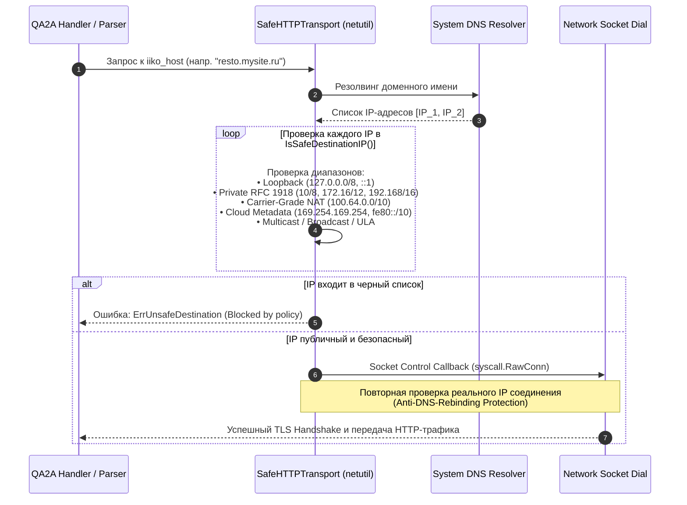

# ЧАСТЬ 3: Безопасность и Авторизация (Security Flow)

Безопасность экосистемы QA2A построена на принципах эшелонированной защиты (Defense in Depth), криптографической устойчивости к атакам на сессии и строгой сетевой изоляции.

---

## 3.1. Аутентификация через Telegram WebApp (`initData`)

Вход конечных пользователей (персонала ресторанов) реализован без классических логинов и паролей. Доверенным провайдером идентификации (IdP) выступает платформа **Telegram WebApp**.

```
[Пользователь] ──> [Telegram Client] ──> [Открытие WebApp]
                            │
                            ▼
        Генерация криптографической строки initData:
        auth_date=1727210000&query_id=...&user={"id":123456,...}&hash=HEX_SIGNATURE
                            │
                            ▼
     POST /api/auth {"initData": "..."} ──> [QA2A Backend]
                                                │
       ┌────────────────────────────────────────┴────────────────────────────────────────┐
       ▼                                                                                 ▼
1. Проверка срока жизни (Replay Attack):                           2. Вычисление эталонной подписи (HMAC-SHA256):
   Now - auth_date <= 24h                                             secret = HMAC-SHA256("WebAppData", botToken)
   auth_date - Now <= 5min                                            dataCheckString = sort(keys(params - hash))
                                                                      expectedHash = HMAC-SHA256(secret, dataCheckString)
                                                                                         │
                                                                                         ▼
                                                                  3. Безопасное сравнение подписей:
                                                                     hmac.Equal(expectedHash, hash)
```

### Алгоритм валидации в `internal/auth/telegram.go`:
1. **Защита от атак повторного воспроизведения (Replay Attacks)**:
   * Из строки `initData` извлекается параметр `auth_date`.
   * Константа `MaxInitDataAge = 24 * time.Hour` ограничивает максимальный возраст запроса.
   * Дополнительно блокируются метки времени из будущего с дельтой более 5 минут (`time.Until(authTime) > 5*time.Minute`).
2. **Формирование строки проверки (`dataCheckString`)**:
   * Извлекаются все пары `key=value`, кроме поля `hash`.
   * Ключи сортируются в строго алфавитном порядке (`sort.Strings(keys)`).
   * Пары объединяются через символ переноса строки `\n`.
3. **Двухэтапный расчет HMAC-SHA256**:
   * Секретный ключ деривируется на основе токена бота с константной строкой:
     $$\text{SecretKey} = \text{HMAC-SHA256}(\text{"WebAppData"}, \text{BOT\_TOKEN})$$
   * Вычисляется хеш строки проверки:
     $$\text{ExpectedHash} = \text{HEX}(\text{HMAC-SHA256}(\text{SecretKey}, \text{dataCheckString}))$$
4. **Безопасное сравнение**:
   Сравнение полученного хеша с `hash` из параметров осуществляется через `hmac.Equal`, что исключает утечки по времени (Timing Attacks).

---

## 3.2. Механизм Signed Tokens и инвалидация сессий (`token_version`)

После успешной верификации `initData` сервис не сохраняет тяжелые сессии в памяти или Redis, а выпускает криптографически подписанный токен (Stateless Signed Token).

### Структура токена:
```text
tgID:token_version:exp:signature
```
* `tgID` (`int64`): уникальный Telegram ID пользователя.
* `token_version` (`int`): монотонно возрастающая версия сессий пользователя из таблицы `users.token_version`.
* `exp` (`int64`): Unix Timestamp истечения срока действия (по умолчанию +30 суток).
* `signature` (`string`): HEX-представление $\text{HMAC-SHA256}(\text{BOT\_TOKEN}, \text{"tgID:version:exp"})$.

### Верификация в `internal/middleware/auth.go`:
1. **Извлечение токена**: токен извлекается исключительно из HTTP-заголовков `X-Telegram-ID` или `Authorization: Bearer <token>`. Использование query-параметров (`?tg_id=`) заблокировано в коде для предотвращения утечки токенов в access-логи балансировщиков и прокси.
2. **Криптографическая верификация**: проверяется подлинность сигнатуры и срок годности `exp`.
3. **Проверка `token_version` (Мгновенный отзыв доступа)**:
   * При исключении сотрудника из заведения (`RemoveMemberHandler` в `internal/handlers/company.go`), сервис выполняет:
     ```sql
     UPDATE users SET token_version = token_version + 1 WHERE id = $1;
     ```
   * В `AuthMiddleware` выполняется сверка:
     ```go
     if user.TokenVersion != tokenVersion {
         sendUnauthorizedResponse(w, "Сессия была инвалидирована...")
         return
     }
     ```
   * Все ранее выданные токены на всех устройствах пользователя становятся недействительными мгновенно, без ожидания истечения 30-дневного TTL.

---

## 3.3. Шифрование учетных данных iiko RMS (AES-256 GCM)

Пароли от API iiko RMS хранятся в зашифрованном виде в колонке `companies.iiko_api_password`. Исходный открытый пароль никогда не отдается клиентам по API (в структуре `models.Company` поле помечено тегом `json:"-"`).

Реализация шифрования сосредоточена в `internal/crypto/crypto.go` и `iiko_parser/crypto/crypto.go`:

```
                       Passphrase (ENCRYPTION_KEY >= 32 chars)
                                        │
                                        ▼
             PBKDF2-HMAC-SHA256 (Salt: "qa2a-aead-salt-2026-v1", 100,000 итераций)
                                        │
                                        ▼
                            32-байтовый ключ (256-bit)
                                        │
             ┌──────────────────────────┴──────────────────────────┐
             ▼                                                     ▼
     Crypto/Rand (12 байт)                                   AES-256 Cipher
             │                                                     │
             ▼                                                     ▼
       [Random Nonce] ───────────────────────────────>      GCM Authenticator
                                                                   │
                                                                   ▼
       Plaintext (Пароль iiko) ──────────────────────> AEAD Encrypt & Tag Generation
                                                                   │
                                                                   ▼
                                                 Base64([12-byte Nonce] + [Ciphertext + Tag])
```

### Гарантии криптографической схемы:
1. **Деривация ключа**: Для защиты от атак по предвычисленным таблицам (Rainbow Tables) мастер-ключ прогоняется через **PBKDF2** с солью `qa2a-aead-salt-2026-v1` и 100 000 итерациями SHA-256.
2. **Аутентифицированное шифрование (AEAD)**: Режим **GCM (Galois/Counter Mode)** гарантирует как конфиденциальность, так и целостность данных. Любая попытка подделки байтов в БД приведет к ошибке аутентификации блока (`cipher: message authentication failed`).
3. **Уникальность вектора инициализации (Nonce)**: Для каждой операции шифрования генерируется криптографически стойкий случайный 12-байтовый `nonce` (`crypto/rand`). Повторение nonce при одном ключе полностью исключено.
4. **Обратная совместимость**: В коде предусмотрен fallback-метод `deriveKeyLegacy` для плавной миграции записей, зашифрованных ранними версиями системы с одиночным SHA-256 хешированием ключа.

---

## 3.4. Межсервисное взаимодействие (`EXTERNAL_API_KEY`)

Взаимодействие между основным монолитом `qa2a` и микросервисом `iiko_parser` происходит по защищенному каналу.

### Сценарии взаимодействия:
* **Передача бланков инвентаризации**: бухгалтер создает шаблон пересчета в интерфейсе `iiko_parser`, и сервис отправляет его в бэкенд QA2A через `POST /api/external/inventory-templates`.
* **Разрешение неопознанных списаний**: передача подтвержденных соответствий неучтенных товаров (`Unlisted/Ghost Items`) из бухгалтерского контура в складской журнал ресторана.

### Защита от атак по времени (Timing Attacks):
Проверка межсервисного ключа в `internal/handlers/inventories.go` выполняется с использованием безопасного побайтового сравнения постоянного времени:
```go
authHeader := r.Header.Get("Authorization")
token := strings.TrimSpace(strings.TrimPrefix(authHeader, "Bearer "))

// Защита от timing attacks:
if token == "" || subtle.ConstantTimeCompare([]byte(token), []byte(expectedToken)) != 1 {
    respondError(w, http.StatusUnauthorized, "Недействительный токен межсервисного взаимодействия")
    return
}
```

---

## 3.5. Защита от SSRF и DNS-Rebinding (`netutil/validator.go`)

Поскольку заведения самостоятельно указывают хост своего локального или облачного сервера iiko RMS (`companies.iiko_host`), возникает критический риск атак класса **SSRF (Server-Side Request Forgery)** — злоумышленник может указать адрес `http://127.0.0.1:5432`, `http://169.254.169.254` (сервис метаданных облачных провайдеров AWS/GCP/VK Cloud) или локальный адрес внутренней сети.

В пакете `pkg/netutil/validator.go` реализована комплексная защита на уровне транспортного уровня Go:



### Защита от DNS-Rebinding (Time-of-Check to Time-of-Use):
Обычной валидации URL перед запросом недостаточно, так как DNS-сервер атакующего может вернуть публичный IP при первой проверке и приватный IP `127.0.0.1` в момент вызова `http.Get`. 

Для нейтрализации этой уязвимости в `NewSafeHTTPTransport` используется механизм низкоуровневого перехвата установки сокета через функцию `net.Dialer.Control`:
```go
dialer := &net.Dialer{
    Timeout: dialTimeout,
    Control: func(network, address string, c syscall.RawConn) error {
        host, _, _ := net.SplitHostPort(address)
        ip := net.ParseIP(host)
        if ip != nil && !IsSafeDestinationIP(ip) {
            return fmt.Errorf("%w: попытка подключения к %s", ErrUnsafeDestination, host)
        }
        return nil
    },
}
```
Соединение разрывается операционной системой непосредственно перед отправкой первого TCP-пакета SYN, если конечный IP принадлежит запрещенному диапазону.
