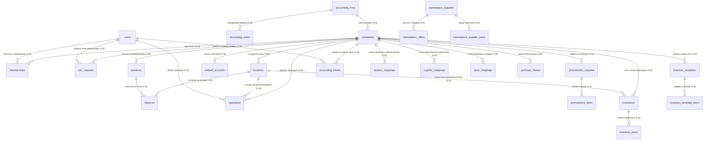

# ЧАСТЬ 4: Схема базы данных (Domain Model)

База данных QA2A функционирует под управлением СУБД **PostgreSQL 14+**. Архитектура данных сочетает реляционную нормализацию (3NF) для финансовых и инвентаризационных проводок с элементами денормализации и полями `JSONB` для высоконагруженных выборок маркетплейса и аудита.

---

## 4.1. Концептуальная диаграмма сущностей (ERD)

---

## 4.2. Архитектура Мультиарендности (Multi-Tenancy)

В системе реализован паттерн **Logical Separation (Shared Database, Separate Tenant IDs)**:

1. **Изоляция на уровне заведений (`company_id`)**:
   * Все таблицы складского и операционного контура (`locations`, `positions`, `balances`, `operations`, `procurements`, `inventories`, `tickets`) имеют обязательный внешний ключ `company_id INT NOT NULL REFERENCES companies(id) ON DELETE CASCADE`.
   * Любой запрос на чтение или изменение данных обязательно включает предикат `WHERE company_id = $1`.
   * Метод `getCompanyID(r)` на уровне HTTP-хэндлеров проверяет членство пользователя в указанном заведении перед отдачей данных.
2. **Изоляция на уровне бухгалтерских компаний (`accounting_firm_id`)**:
   * Бухгалтерские аутсорсинговые компании представлены в таблице `accounting_firms`.
   * Таблица `companies` имеет поле `accounting_firm_id REFERENCES accounting_firms(id) ON DELETE SET NULL`.
   * Бухгалтер с ролью `accountant` видит **только те заведения**, у которых `companies.accounting_firm_id` совпадает с его собственной фирмой (`accounting_users.accounting_firm_id`).
   * Роли `superadmin` и `global_accountant` имеют глобальный доступ (Godmode bypass) ко всем заведениям системы.

---

## 4.3. Описание основных таблиц базы данных (по `schema.sql`)

### 1. Организации и Пользователи

#### `companies`
Хранилище юридических лиц и заведений питания.
* `id` (`SERIAL PRIMARY KEY`): идентификатор заведения.
* `name` (`VARCHAR(255)`): коммерческое наименование ресторана/бара.
* `invite_code` (`VARCHAR(50) UNIQUE`): буквенно-цифровой промокод для присоединения сотрудников.
* `iiko_host` (`VARCHAR(255)`): адрес сервера iiko RMS (напр. `https://resto.mysite.ru:443`).
* `iiko_api_login` (`VARCHAR(255)`): логин пользователя API iiko RMS с правами экспорта накладных.
* `iiko_api_password` (`VARCHAR(255)`): зашифрованный AES-256 GCM пароль API.
* `iiko_writeoff_account` (`VARCHAR(255)`): дефолтный GUID статьи списания по умолчанию.
* `accounting_firm_id` (`INT NULL`): связь с бухгалтерской компанией на аутсорсе.

#### `users`
Профили пользователей в экосистеме Telegram.
* `id` (`SERIAL PRIMARY KEY`): идентификатор пользователя в БД.
* `tg_id` (`BIGINT UNIQUE`): постоянный Telegram ID пользователя.
* `username` (`VARCHAR(255)`): никнейм в Telegram (без символа `@`).
* `full_name` (`VARCHAR(255)`): отображаемое имя (First + Last Name).
* `token_version` (`INT DEFAULT 1`): счетчик версии сессии для моментальной инвалидации токенов.

#### `memberships`
Связующая таблица ролевого доступа пользователей к заведениям (M:N).
* `user_id` (`INT REFERENCES users(id)`).
* `company_id` (`INT REFERENCES companies(id)`).
* `role` (`VARCHAR(50)`): роль сотрудника (`owner`, `admin`, `manager`, `user`).
* `custom_title` (`VARCHAR(255)`): должность в штатном расписании (напр. «Шеф-кондитер», «Старший бармен»).
* **Первичный ключ**: составной `PRIMARY KEY (user_id, company_id)`.

#### `join_requests`
Очередь входящих заявок на вступление по инвайт-коду до подтверждения администратором.

---

### 2. Складской контур, номенклатура и остатки

#### `locations`
Физические и виртуальные склады внутри заведения.
* `id` (`SERIAL PRIMARY KEY`).
* `company_id` (`INT REFERENCES companies(id)`).
* `name` (`VARCHAR(255)`): название («Кухня», «Бар», «Основной склад», «Фасовка»).
* `external_id` (`VARCHAR(255)`): GUID склада в iiko RMS.

#### `positions`
Каталог сырья, полуфабрикатов и готовой продукции.
* `id` (`SERIAL PRIMARY KEY`).
* `company_id` (`INT REFERENCES companies(id)`).
* `name` (`VARCHAR(255)`): наименование позиции в учете.
* `unit` (`VARCHAR(50)`): базовая единица измерения («кг», «л», «шт», «порц»).
* `external_id` (`VARCHAR(255)`): GUID номенклатурной карточки в iiko RMS.
* `type` (`VARCHAR(50)`): тип карточки в iiko (`GOODS` — товар/сырье, `PREPARED` — заготовка/полуфабрикат, `DISH` — блюдо, `MODIFIER` — модификатор).
* `conception` (`VARCHAR(500)`): дерево родительских товарных групп (напр. «Бар / Алкоголь / Джин»).
* **Индекс уникальности**: `idx_positions_company_ext_id UNIQUE (company_id, external_id) WHERE external_id != ''`.

#### `balances`
Текущие количественные остатки в разрезе складов и позиций.
* `company_id`, `location_id`, `position_name` — составной первичный ключ `PRIMARY KEY (company_id, location_id, position_name)`.
* `quantity` (`NUMERIC(12, 3)`): текущий физический остаток.
* `avg_price` (`NUMERIC(12, 2)`): средневзвешенная себестоимость за единицу.

#### `operations`
Неизменяемый журнал всех складских проводок (Ledger).
* `id` (`SERIAL PRIMARY KEY`).
* `company_id`, `location_id`, `user_id`.
* `to_location_id` (`INT DEFAULT 0`): целевой склад (для перемещений).
* `type` (`VARCHAR(50)`): тип складского движения:
  * `writeoff`: списание (порча, проработка, питание персонала, бой).
  * `transfer_in` / `transfer_out`: межскладское перемещение.
  * `assembly_in` / `assembly_out`: акт переработки/приготовления полуфабриката.
* `position_name` (`VARCHAR(255)`): наименование списываемого товара.
* `quantity` (`NUMERIC(12, 3)`): объем операции.
* `status` (`VARCHAR(50)`): статус согласования (`approved`, `pending`, `rejected`).
* `is_unlisted` (`BOOLEAN`): флаг неучтенной позиции (Ghost Item).
* `account_id` (`VARCHAR(255)`): GUID статьи списания iiko.
* `exported_to_iiko` (`BOOLEAN DEFAULT FALSE`): флаг успешной выгрузки в iiko RMS.
* `created_at` (`TIMESTAMP WITH TIME ZONE DEFAULT NOW()`).

---

### 3. Инвентаризация и Бланки

#### `inventories` & `inventory_items`
* `inventories`: заголовок документа ревизии (`status`: `in_progress`, `completed`, `iiko_document_id`, `document_number`).
* `inventory_items`: строки сличительной ведомости:
  * `position_name` (`VARCHAR(255)`).
  * `external_id` (`VARCHAR(255)`): GUID в iiko.
  * `expected_amount` (`NUMERIC(12, 3)`): расчетный книжный остаток (полученный из OLAP-отчета iiko на момент старта).
  * `actual_amount` (`NUMERIC(12, 3)`): фактически пересчитанное количество.

#### `inventory_templates` & `inventory_template_items`
Шаблоны бланков пересчета, подготавливаемые бухгалтером в `iiko_parser` (напр. «Ночной пересчет бара», «Еженедельный бланк мяса»).

---

### 4. B2B Маркетплейс и Поставщики

#### `marketplace_suppliers`
Профили поставщиков и дистрибьюторов сырья.
* `id` (`SERIAL PRIMARY KEY`).
* `company_name` (`VARCHAR(255)`).
* `contact_phone`, `contact_email`.
* `invite_code` (`VARCHAR(50) UNIQUE`): код для подключения торговых представителей.

#### `marketplace_offers`
Товарные предложения поставщиков на витрине маркетплейса.
* `supplier_id` (`INT REFERENCES marketplace_suppliers(id)`).
* `title` (`VARCHAR(255)`): наименование предложения.
* `description` (`TEXT`).
* `price_type` (`VARCHAR(50)`): тип цены (`exact` — фиксированная, `from` — оптовая от объема, `request` — по запросу).
* `price_value` (`NUMERIC(12, 2)`).
* `keywords` (`JSONB`): массив поисковых тегов (поиск через GIN-индекс).
* `is_active` (`BOOLEAN DEFAULT true`).
* `views_count`, `clicks_count`: метрики конверсии и интереса ресторанов.

#### `marketplace_supplier_users`
Представители поставщиков в Telegram.
* `tg_id` (`BIGINT UNIQUE`), `supplier_id`, `role` (`admin`, `rep`).

---

### 5. Service Desk (Заявки в бухгалтерию)

#### `accounting_tickets`
Двусторонняя тикетная система взаимодействия ресторанной смены с бухгалтерской службой.
* `id` (`SERIAL PRIMARY KEY`).
* `company_id`, `user_id`.
* `category` (`VARCHAR(100)`): категория инцидента (`invoice_error`, `discrepancy`, `tt_question`, `other`).
* `priority` (`VARCHAR(50)`): приоритет (`low`, `normal`, `urgent`).
* `description` (`TEXT`): подробное описание проблемы поваром/барменом.
* `status` (`VARCHAR(50)`): статус тикета (`new`, `in_progress`, `resolved`, `closed`).
* `accountant_comment` (`TEXT`): официальный ответ бухгалтера-калькулятора.
* `media_paths` (`TEXT DEFAULT '[]'`): сериализованный JSON-массив путей к загруженным фото.

---

### 6. Таблицы сопоставлений (Mappings) и аналитики парсера

#### `product_mappings`, `supplier_mappings`, `store_mappings`
Таблицы памяти AI-парсера:
* При первом распознавании УПД бухгалтер связывает текстовую строку из накладной поставщика с GUID конкретного товара в iiko RMS и указывает коэффициент пересчета `multiplier`.
* Записи кэшируются в `product_mappings`. При последующих сканированиях накладных этой связки система маппит товары со 100% точностью без участия человека.

#### `purchase_history` (Аналитическое хранилище)
Денормализованная таблица всех когда-либо оприходованных позиций по накладным всех заведений:
* Хранит `invoice_date`, `supplier_name`, `product_name_in_invoice`, `clean_category`, `brand`, `quantity`, `price_per_base_unit` (приведенную цену за 1 кг/л).
* Является датасетом для алгоритмов арбитража цен, выявления монополий поставщиков и мониторинга реальной отраслевой инфляции.
