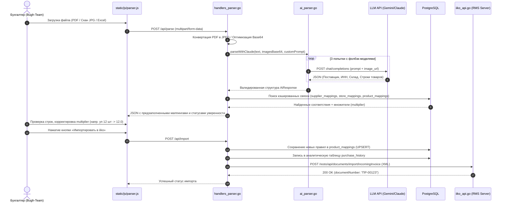
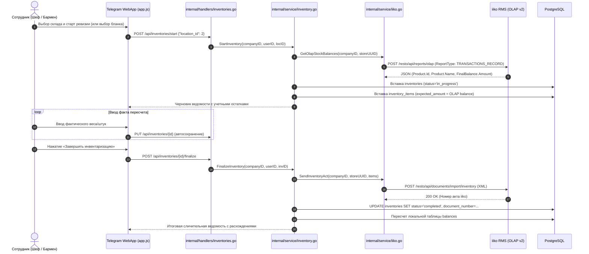

# ЧАСТЬ 5: Ключевые бизнес-флоу (Business Logic Flows)

В данном разделе подробно, по шагам описаны ключевые сквозные сценарии системы с указанием участвующих компонентов, файлов кода и форматов данных.

---

## 5.1. Флоу AI-парсинга первичных документов (УПД/Торг-12/Чеки)

Процесс перевода неструктурированных первичных документов в приходные накладные iiko RMS.



### Детали расчета коэффициента пересчета (`multiplier`):
* Поставщики отгружают товар в коммерческих упаковках (ящики, кеги, спайки по 12 шт., коробки по 5 кг), а складской учет в iiko ведется в базовых единицах (кг, литры, штуки).
* **Формула оприходования в `iiko_api.go`**:
  $$\text{Количество в iiko} = \text{Количество в накладной} \times \text{multiplier}$$
  $$\text{Цена за базовую единицу в iiko} = \frac{\text{Цена позиции в накладной}}{\text{multiplier}}$$
* Сохраненный `multiplier` кэшируется в `product_mappings (company_id, vendor_name, vendor_item_name)` и в дальнейшем подставляется автоматически.

---

## 5.2. Флоу проведения и финализации инвентаризации

Сценарий сверки фактических остатков ресторана с учетной базой.



---

## 5.3. Регламентная ночная выгрузка операций (`scheduler.go`)

Фоновый процесс, исключающий необходимость ручной проводки сотен ежедневных списаний поварами и барменами в бэк-офисе.

```
[Фоновый таймер (06:30 YEKT / Asia/Yekaterinburg)]
                        │
                        ▼
            TryLock: isExporting.TryLock()
   (Предотвращение параллельных запусков выгрузки)
                        │
                        ▼
1. Очистка старых данных:
   • CleanOldProcurements: удаление заявок старше 30 дней
   • Очистка uploads/tickets: удаление фото из тикетов старше 14 дней
                        │
                        ▼
2. Выборка активных заведений:
   repo.GetAllActiveCompanyIDs() (только с настроенными iiko_host/login)
                        │
                        ▼
3. Итерация по заведениям (с паузой 2 секунды между ними):
   ExportDailyOperations(companyID, isNightly=true)
                        │
                        ├───────────────────────────────────────────────────────┐
                        ▼                                                       ▼
            Списания (writeoffs):                               Межскладские перемещения (transfers):
            • Выборка operations WHERE exported=false           • Агрегация парных проводок transfer_out/in
            • Группировка по статьям расходов iiko              • Формирование XML transferDocument
            • Добавление заметок шефа (shift-note)              • POST /resto/api/documents/import/transferDocument
            • Формирование XML writeoffDocument                                 │
            • POST /resto/api/documents/import/writeoffDocument                 ▼
                        │                                       Пометка exported_to_iiko = true
                        ▼
            Пометка exported_to_iiko = true
                        │
                        ▼
4. Вызов OnExportComplete callback:
   tgBot.SendFullBackup() -> Создание pg_dump базы данных и отправка файла в Telegram администратору
```

---

## 5.4. Флоу обработки неучтенки (Ghost Items / Unlisted)

Когда линейный повар или бармен списывает позицию, которой еще нет в учетном справочнике iiko (новое сырье, закупленное на рынке за наличные):
1. **Фиксация с флагом `is_unlisted = true`**:
   * В приложении персонал вводит свободное текстовое наименование и выбирает единицу измерения.
   * Запись сохраняется в `operations` со статусом `is_unlisted = true` и исключается из автоматической ночной выгрузки в iiko (чтобы не сломать импорт несуществующим UUID).
2. **Оповещение и разбор в `iiko_parser`**:
   * На рабочем месте бухгалтера в разделе «Неучтенка» (`/api/unlisted-operations`) отображаются все зависшие списания.
   * Бухгалтер может:
     * **Сопоставить**: завести карточку в iiko RMS, указать ее GUID и вызвать `POST /api/unlisted-operations/resolve`. Операция связывается с позицией и отправляется в iiko.
     * **Отклонить**: вызвать `POST /api/unlisted-operations/reject` с комментарием повару (товар списывается за счет сотрудника или переводится на другую статью).

---

## 5.5. B2B Маркетплейс и Конструктор сделок (Godmode)

Модуль маркетплейса решает задачу оптовых закупок и аналитики:

1. **Кабинет поставщика (`internal/handlers/supplier_portal.go`)**:
   * Поставщик регистрируется, вводит промокод и получает доступ к управлению офферами.
   * Добавляет позиции: наименование, категория, диапазон цен (`exact`, `from`, `request`), поисковые ключевые слова (`keywords` в формате `JSONB`).
2. **Витрина ресторана (`internal/handlers/marketplace.go`)**:
   * Рестораны ищут сырье по каталогу.
   * Система фиксирует показы (`views_count`) и клики (`clicks_count`) для расчета конверсии поставщика.
3. **Аналитический терминал суперадмина (`iiko_parser/market_api.go`)**:
   * **Арбитраж цен (`/api/market/arbitrage`)**: система сопоставляет цены закупки одного и того же товара (по штрихкоду/наименованию) между разными ресторанами города и подсвечивает заведения, переплачивающие более 15% от медианы.
   * **Анализ инфляции (`/api/market/inflation`)**: скользящий помесячный расчет роста себестоимости ключевых ингредиентов (лосось, сливки, масло, сыр).
   * **Демпинг и риски монополии (`/api/market/dumping`, `/api/market/dependency`)**: выявление аномально низких цен от новых поставщиков и доли зависимости ресторана от одного контрагента.
